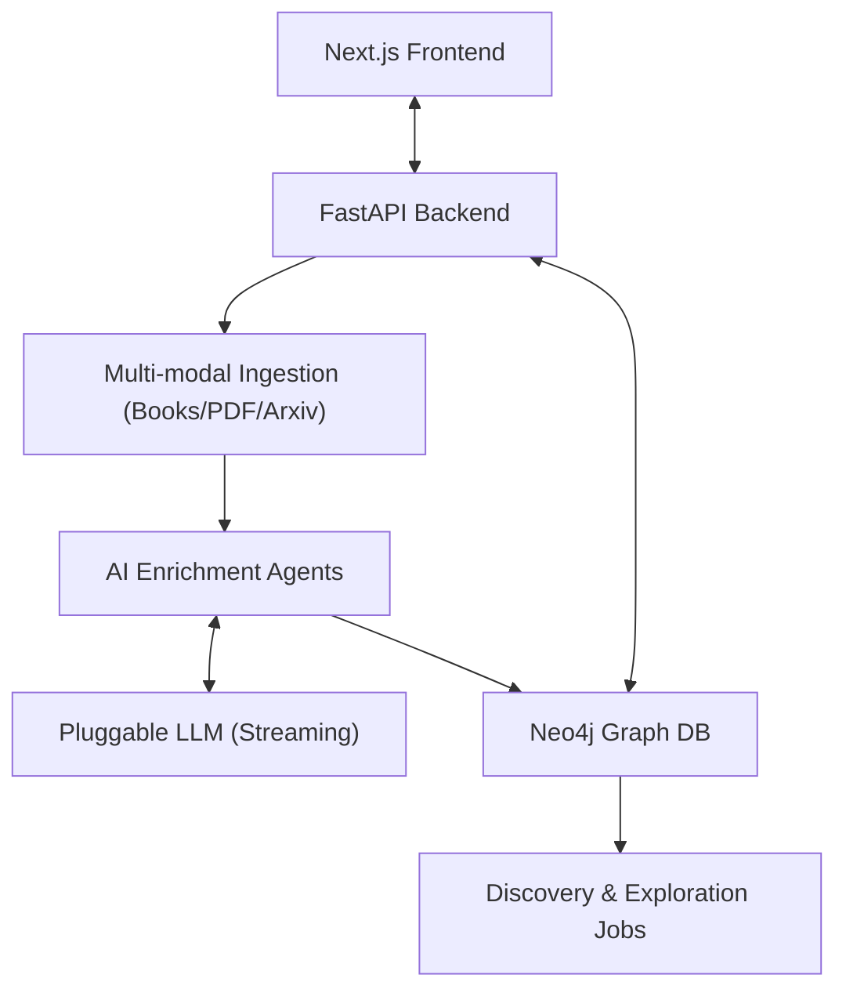

# BookGraph

BookGraph turns your reading list and research papers into a dynamic knowledge globe and an AI-powered discovery engine.

It ingests books and documents, extracts concepts using LLM-backed agents, builds structural relationships in Neo4j, and lets you interact with your knowledge through a real-time neural-map and streaming AI chat.

## What The App Does

1. **Multi-Modal Ingestion:** Add items from Open Library, Google Books, arXiv, or upload local PDFs.
2. **Automated Enrichment:** LLM agents "read" metadata/PDF text to extract core concepts, fields, and bibliographic data.
3. **Strategic Graphing:** Automatically builds relationships between new and existing items (e.g., *Influenced By*, *Contradicts*, *Expands*).
4. **Knowledge Globe:** Visualize your entire intellectual landscape as an interactive, high-performance "galaxy" of nodes.
5. **Queryable Intelligence:** Talk to your library using real-time streaming chat that can perform complex Cypher reasoning over the graph's structure.

## Core Features

- **Knowledge Ingestion:** Seamless addition of books and academic papers with automated metadata extraction.
- **Neural Globe:** High-performance canvas-based visualization of your knowledge base with organic physics.
- **Structural Reasoning:** AI Chat that writes Cypher queries to answer structural questions (e.g., *"Find authors who wrote about both Physics and Philosophy"*).
- **Real-time Streaming:** Token-by-token AI responses for a modern messaging experience.
- **Discovery Engine:** Automated background detection of thematic clusters and reading paths.
- **Resource Management:** Easily curate your graph with a "Recently Ingested" dashboard and node deletion.

## Tech Stack

- **Frontend:** Next.js + react-force-graph-2d
- **Backend:** FastAPI + python-multipart + PyPDF2
- **Graph DB:** Neo4j
- **LLM providers:** OpenAI, OpenRouter, or Ollama

## Project Structure

```text
bookgraph/
├── backend/
│   ├── app/
│   │   ├── agents/       # LLM Agent logic (Chat, Metadata, Relationship)
│   │   ├── api/          # FastAPI routes and schemas
│   │   ├── enrichment/   # Concept extraction logic
│   │   ├── graph/        # Neo4j repository layer
│   │   ├── ingestion/    # API clients (Google Books, Arxiv, OpenLibrary)
│   │   └── services/     # Business logic orchestration
│   ├── main.py
│   └── requirements.txt
├── frontend/
│   ├── app/              # Next.js App Router (Ingestion, Chat, Globe)
│   ├── components/       # Shared UI and Graph Canvas
│   ├── public/           # Static assets (Favicon)
│   └── lib/              # API utilities
├── docker/
│   └── docker-compose.yml
└── README.md
```

## Quick Start

### Option 1: Docker (recommended)

```bash
cd docker
docker compose up --build
```

- Frontend: `http://localhost:3000`
- Backend: `http://localhost:8000`
- API docs: `http://localhost:8000/docs`
- Neo4j Browser: `http://localhost:7474` (`neo4j` / `bookgraph`)

### Option 2: Local dev

Backend:
```bash
cd backend
python3 -m venv .venv
source .venv/bin/activate # or .venv\Scripts\activate on Windows
pip install -r requirements.txt
uvicorn main:app --reload --port 8000
```

Frontend:
```bash
cd frontend
npm install
npm run dev
```

## Key API Endpoints

- `POST /books` | `POST /google-books` | `POST /papers`: Ingest resources
- `POST /pdf`: Upload and extract metadata from local PDF
- `GET /graph`: Fetch global snapshot for the Globe view
- `DELETE /graph/nodes/{node_id}`: Remove specific items/nodes
- `POST /chat/stream`: Streaming AI chat with graph context
- `GET /discoveries`: View automated graph insights

## Graph Model

- **Nodes:** `Book`, `Paper`, `Author`, `Concept`, `Field`
- **Relationships:** `WRITTEN_BY`, `MENTIONS`, `BELONGS_TO`, `RELATED_TO`, `INFLUENCED_BY`, `CONTRADICTS`, `EXPANDS`

## LLM Configuration

Set provider in backend `.env`:
- OpenAI: `MODEL_PROVIDER=openai`
- OpenRouter: `MODEL_PROVIDER=openrouter`
- Ollama: `MODEL_PROVIDER=ollama`

## Architecture



## Future Enhancements

- **PDF Full-Text Search:** Vector indexing of entire document contents.
- **Author Influence Mapping:** Deep-dive into author citation networks.
- **YouTube/Podcasts:** Transcribing and graphing audio-visual knowledge.
- **Browser Extension:** One-click ingestion from Amazon or Arxiv.
