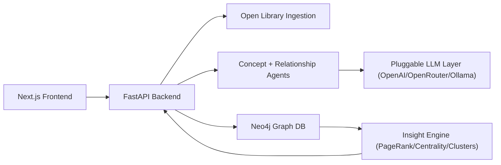

# BookGraph

BookGraph is an open-source MVP that transforms a list of books into a knowledge graph of books, authors, concepts, fields, and cross-book relationships using AI.

## Project Structure

```text
bookgraph/
├── backend/
│   ├── app/
│   │   ├── ingestion/
│   │   ├── enrichment/
│   │   ├── agents/
│   │   ├── graph/
│   │   ├── insights/
│   │   ├── api/
│   │   └── main.py
│   ├── main.py
│   └── requirements.txt
├── frontend/
│   ├── app/
│   ├── components/
│   └── graph/
├── docker/
│   └── docker-compose.yml
└── README.md
```

## Backend MVP Features

- `POST /books` ingests a book title, fetches Open Library metadata, enriches with AI concepts/fields, and creates graph relationships.
- `GET /graph` returns graph nodes and edges for visualization.
- `GET /insights` returns central books, clusters, and missing-topic coverage.

## Architecture



## Graph Model

### Nodes
- `Book`
- `Author`
- `Concept`
- `Field`

### Relationships
- `WRITTEN_BY`
- `MENTIONS`
- `RELATED_TO`
- `INFLUENCED_BY`
- `CONTRADICTS`
- `EXPANDS`
- `BELONGS_TO`

## Run Locally

### Option 1: Docker Compose

1. From `bookgraph/docker`, run:
   ```bash
   docker compose up --build
   ```
2. Open:
   - Frontend: `http://localhost:3000`
   - Backend docs: `http://localhost:8000/docs`
   - Neo4j Browser: `http://localhost:7474` (user `neo4j`, password `bookgraph`)

### Option 2: Backend only (local Python)

1. Create env and install:
   ```bash
   cd backend
   python -m venv .venv
   source .venv/bin/activate
   pip install -r requirements.txt
   ```
2. Copy env:
   ```bash
   cp .env.example .env
   ```
3. Start API:
   ```bash
   uvicorn main:app --reload
   ```

## LLM Provider Configuration

Switch providers without code changes via environment variables:

- OpenAI
  - `LLM_PROVIDER=openai`
  - `LLM_API_KEY=<your_key>`
  - Optional: `LLM_MODEL=gpt-4o-mini`
- OpenRouter
  - `LLM_PROVIDER=openrouter`
  - `OPENROUTER_API_KEY=<your_key>` (or `LLM_API_KEY`)
  - Optional: `OPENROUTER_MODEL=openai/gpt-4o-mini` (or `LLM_MODEL`)
- Ollama
  - `LLM_PROVIDER=ollama`
  - Optional: `OLLAMA_BASE_URL=http://localhost:11434/v1` (or `LLM_BASE_URL`)
  - Optional: `OLLAMA_MODEL=llama3.1:8b` (or `LLM_MODEL`)

If no usable provider credentials are set, BookGraph falls back to heuristic concept/relationship extraction.

## API Examples

### Add Book

```bash
curl -X POST http://localhost:8000/books \
  -H "Content-Type: application/json" \
  -d '{"title":"Clean Code"}'
```

### Get Graph

```bash
curl http://localhost:8000/graph
```

### Get Insights

```bash
curl http://localhost:8000/insights
```

## Contribution Guide

1. Fork the repo and create a branch with prefix `codex/`.
2. Keep modules small and typed; use service-layer orchestration, not route-level business logic.
3. Add tests for ingestion, agent parsing, and graph query behavior before merging larger changes.
4. Open a PR with architecture notes and sample payloads.

## Roadmap

- Reading path generation
- Knowledge gap detection
- Multi-source ingestion (papers, videos)
- Semantic question answering over graph
