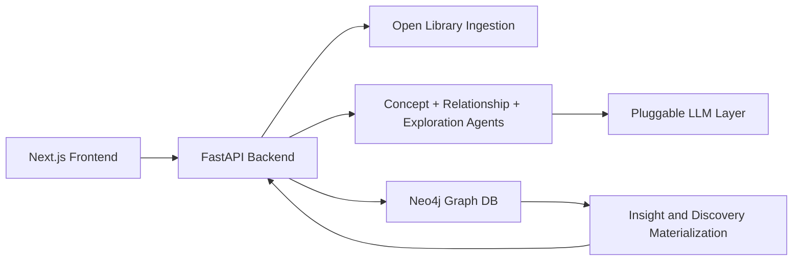

# BookGraph

BookGraph turns your reading list into a knowledge graph and an AI discovery engine.

It ingests books, extracts concepts and fields, links related titles, and continuously generates discoveries like clusters, reading paths, and knowledge gaps.

## What The App Does

1. Ingest a book title from Open Library metadata.
2. Extract concepts and fields using LLM-backed agents.
3. Build graph relationships across books.
4. Run exploration agents on a schedule to generate insights.
5. Let you search and explore focused subgraphs in the UI.

## Core Features

- Add books and auto-enrich them into graph nodes and edges.
- Search-first graph exploration with node expansion and detail drawer.
- Discovery feed with cluster and cross-field insights.
- Reading path recommendations.
- Knowledge gap detection with suggested bridge books.
- Evidence-grounded graph chat.

## Tech Stack

- Frontend: Next.js + React Flow
- Backend: FastAPI
- Graph DB: Neo4j
- LLM providers: OpenAI, OpenRouter, or Ollama

## Project Structure

```text
bookgraph/
├── backend/
│   ├── app/
│   │   ├── agents/
│   │   ├── api/
│   │   ├── enrichment/
│   │   ├── graph/
│   │   ├── ingestion/
│   │   ├── insights/
│   │   └── services/
│   ├── main.py
│   └── requirements.txt
├── frontend/
│   ├── app/
│   ├── components/
│   └── lib/
├── docker/
│   └── docker-compose.yml
└── README.md
```

## Quick Start

### Option 1: Docker (recommended)

```bash
cd docker
docker compose up --build
```

- Frontend: `http://localhost:3000`
- Backend: `http://localhost:8000`
- API docs: `http://localhost:8000/docs`
- Neo4j Browser: `http://localhost:7474` (`neo4j` / `bookgraph`)

### Option 2: Local dev (backend + frontend)

Backend:

```bash
cd backend
python3 -m venv .venv
source .venv/bin/activate
python3 -m pip install -r requirements.txt
cp .env.example .env
uvicorn main:app --reload --port 8000
```

Frontend (new terminal):

```bash
cd frontend
npm install
npm run dev
```

## Key API Endpoints

- `POST /books` add and enrich a book
- `GET /graph/search` search nodes
- `GET /graph/focus` fetch focused subgraph by node id
- `GET /graph/nodes/{node_id}` get node details + neighbors
- `GET /discoveries` list generated discovery items
- `GET /reading-paths` list generated reading paths
- `GET /knowledge-gaps` list generated gaps
- `GET /insights` decision dashboard snapshot
- `POST /chat` ask graph-grounded questions

## Graph Model

Node labels:

- `Book`
- `Author`
- `Concept`
- `Field`

Relationship types:

- `WRITTEN_BY`
- `MENTIONS`
- `BELONGS_TO`
- `RELATED_TO`
- `INFLUENCED_BY`
- `CONTRADICTS`
- `EXPANDS`

## LLM Configuration

Set provider in backend `.env`:

- OpenAI: `MODEL_PROVIDER=openai` and `OPENAI_API_KEY=...`
- OpenRouter: `MODEL_PROVIDER=openrouter` and `OPENROUTER_API_KEY=...`
- Ollama: `MODEL_PROVIDER=ollama` and optional `OLLAMA_BASE_URL`, `OLLAMA_MODEL`
- Auto fallback: `MODEL_PROVIDER=auto`

If no provider is configured, BookGraph falls back to deterministic heuristics where possible.

## Architecture



## Troubleshooting

- Error: `Cannot reach backend at http://localhost:8000`
  - Ensure backend is running on port `8000`.
  - Verify with `curl http://localhost:8000/health`.
  - If backend runs elsewhere, set `NEXT_PUBLIC_API_BASE_URL` in `frontend/.env.local`.

- Error: `TypeError: got multiple values for argument 'query'`
  - Pull latest code; this has been fixed in graph search query execution.

## Contributing

1. Create a branch prefixed with `codex/`.
2. Keep business logic in services/agents, not route handlers.
3. Add tests for behavior changes.
4. Open a PR with sample requests/responses for new APIs.
